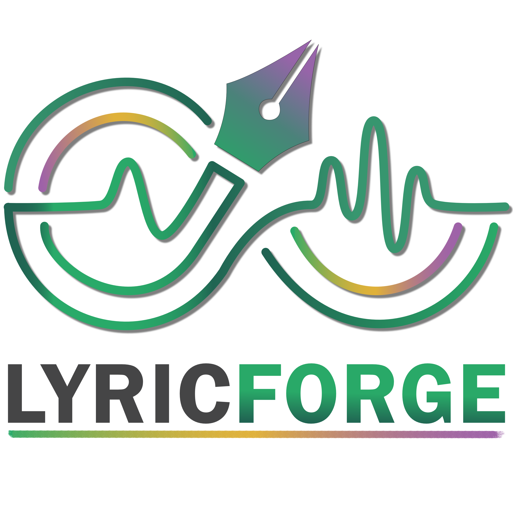

# LyricForge



LyricForge ist eine lokale, offline-fähige Desktop-Applikation für modulares Songwriting und Metrik-Analyse.
Sie richtet sich an Songwriter, Rapper und Dichter, die eine strukturierte Umgebung suchen, um ihre Texte zu schreiben, zu organisieren und phonetisch zu analysieren.

## Hauptfunktionen

*   **Modulares Block-System:** Organisiere deine Songs in verschiebbare Blöcke wie Intro, Verse, Chorus oder eigene Typen.
*   **Live-Phonetik & Silben-Zählung:** Die App analysiert den Text während des Tippens und zählt die Silben in Echtzeit (via Rust-Backend).
*   **Reim- und Klang-Highlighting:** Reime, Assonanzen und Vokalklänge werden farblich direkt im Editor hervorgehoben.
    *   **Dunkelgrün:** Reine Endreime zwischen zwei Zeilenenden.
    *   **Hellgrün:** Reine Reime mit mindestens einem Wort innerhalb einer Zeile.
    *   **Dezentes Gelb:** Assonanzen. Beim Darüberfahren werden das Wort und seine direkten Klangpartner unterstrichen.
    *   **Lila:** Übereinstimmende mehrsilbige Vokalklänge ohne reinen Reim.
    *   Jeder Block wird mit deutschen und englischen Aussprachen analysiert; verglichen werden jeweils Aussprachen derselben Sprache.
    *   Reim- und Klangpartner liegen höchstens zwei nicht leere Textzeilen auseinander. Leerzeilen und Zeilen nur mit Leerzeichen zählen nicht mit; automatische Bildschirmumbrüche ändern den Abstand nicht.
*   **Reim-Helfer:** Finde passende Reime, Assonanzen und Vokalklänge strukturiert nach Silbenanzahl über die rechte Seitenleiste.
    Die Reihenfolge bevorzugt passende Silbenzahlen, ähnliche Vokalfolgen und häufig verwendete Wörter. Die Häufigkeiten stammen aus wordfreq 3.1.1 von Robyn Speer und sind lokal eingebunden. Bei sonst gleichen Werten entscheiden Lautähnlichkeit und Alphabet. Die Begrenzung erfolgt erst nach der Bewertung aller Klangtreffer.
*   **Lokale Speicherung:** Alle Daten bleiben lokal als `.lyricproj`-Datei gespeichert. Kein Cloud-Zwang.
    *   Der Speicherstatus unterscheidet ungespeicherte Änderungen, laufende Dateivorgänge und erfolgreiches Speichern. Fehler werden sichtbar angezeigt.
    *   Beim Öffnen eines anderen Projekts oder Schließen der App wird vor ungespeicherten Änderungen gewarnt. Es gibt noch keine automatische Wiederherstellung nach einem Absturz.
*   **Export:** Exportiere deine fertigen Texte im Klartext (`.txt`) oder als Markdown (`.md`).

## Systemarchitektur

LyricForge nutzt das moderne **Tauri v2** Framework.
*   **Frontend:** React, TypeScript, Tailwind CSS v4, Zustand, ProseMirror/TipTap (für stabile Text-Manipulation und Highlighting).
*   **Backend:** Rust mit SQLite-Wörterbuch für Aussprache, Reime und Silben. Mehrdeutige Silbenzahlen können als Bereich erscheinen; Näherungen werden im Tooltip gekennzeichnet.

## Handbuch für Entwickler

### Voraussetzungen

*   Node.js 24 LTS
*   Rust (cargo)
*   Systemabhängige Tauri-Voraussetzungen (z.B. `build-essential`, `libwebkit2gtk-4.1-dev` auf Linux)

### Installation und Start

1.  Abhängigkeiten installieren:
    ```bash
    npm ci
    ```
2.  Entwicklungsserver starten:
    ```bash
    npm run tauri dev
    ```

### Build

Um die App für dein Betriebssystem zu kompilieren:
```bash
npm run tauri build
```
Die erzeugten Installationsdateien (z.B. `.deb`, `.app`, `.exe`) befinden sich dann unter `src-tauri/target/release/bundle/`.

### Prüfungen und Windows-Installer

Vor einem Release ausführen:
```bash
npm run build
npm test
npm run test:rust
npm run build:windows
```

Die Browsertests verwenden ein installiertes Google Chrome und prüfen die Oberfläche mit simulierten Tauri-Aufrufen. Die Rust-Tests prüfen die echte Analyse und das Wörterbuch; `src-tauri/resources/dictionary.db` muss vorhanden sein. Ein manueller Start des erzeugten Windows-Installers bleibt ein eigener Release-Schritt.

Der Windows-Build erzeugt einen NSIS-Installer (`.exe`) mit dem aktuellen Wörterbuch und den App-Icons. Optional erzeugt `npm run build:windows:msi` ein MSI-Paket; dessen WiX-Validierung benötigt Zugriff auf den Windows-Installer-Dienst. In eingeschränkten Umgebungen kann dieser Schritt mit `LGHT0217` scheitern. Die benötigten Installer-Werkzeuge werden unter `src-tauri/target/.tauri` zwischengespeichert. Beim ersten Build ist dafür Internetzugriff erforderlich. Die Rust-Abhängigkeiten werden anhand der vorhandenen Lockdatei gebaut.

## Nutzung / Workflow

### Häufigkeitsdaten erneuern

Die App benötigt kein Python. Zum erneuten Erzeugen der Daten wird eine separate Python-Umgebung mit `wordfreq==3.1.1` benötigt; anschließend `python scripts/build_frequencies.py` ausführen. Daten und Herkunft sind in `src-tauri/resources/FREQUENCY-DATA.md` dokumentiert. Die abgeleitete Häufigkeitstabelle steht unter CC BY-SA 4.0; vollständige Attributionen werden mit dem Installer ausgeliefert. Fehlende Häufigkeitswerte werden nicht als ungültige Wörter behandelt.

### Schreiben und Suchen

1.  **Neuer Block:** Die App startet mit einem ersten Block. Klicke auf den Typ (z.B. "Verse"), um ihn zu ändern.
2.  **Schreiben:** Tippe deinen Text. Auf der rechten Seite des Blocks siehst du direkt die Silbenanzahl der jeweiligen Zeile.
3.  **Reime finden:** Markiere ein Wort oder doppelklicke darauf, um den "Reim-Helfer" (rechte Seitenleiste) zu öffnen.
    Ein Klick auf einen Vorschlag ersetzt die Auswahl oder fügt ihn an der zuletzt aktiven Cursorposition ein. Strg+Z macht die Änderung rückgängig. Die Kategorien „Rein“, „Assonanz“ und „Vokalklang“ nutzen dieselben Klangregeln wie die Editoranalyse; deren Stopwort- und Zeilenabstandsregeln gelten nur im Textkontext.
4.  **Blöcke organisieren:** Nutze das Drag-Handle (die Punkte links am Block), um ihn per Drag-and-Drop zu verschieben.
5.  **Speichern & Exportieren:** Nutze die Buttons oben rechts, um dein Projekt als `.lyricproj` zu sichern oder den Text zu exportieren.
